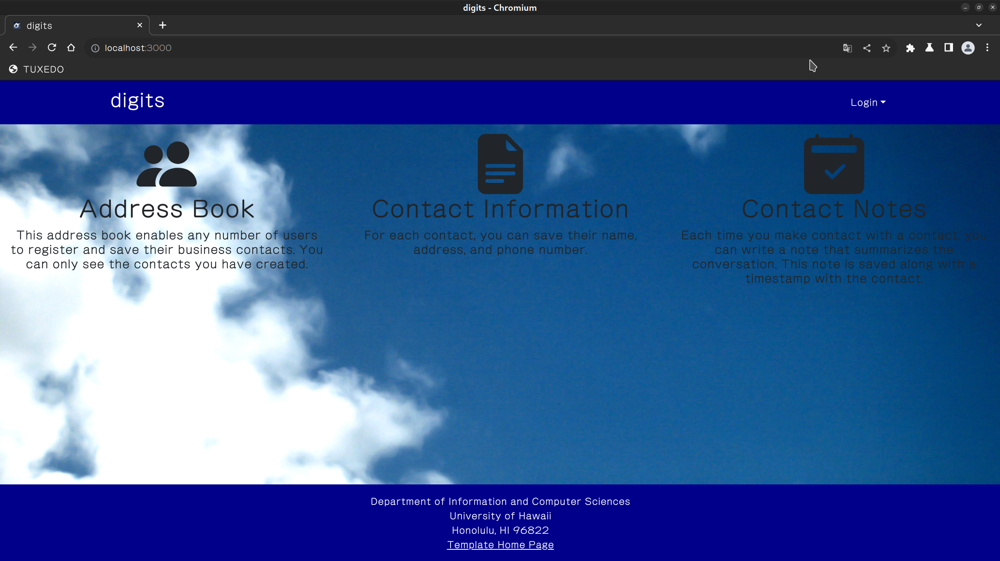
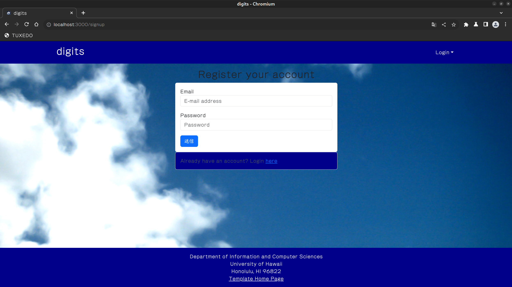
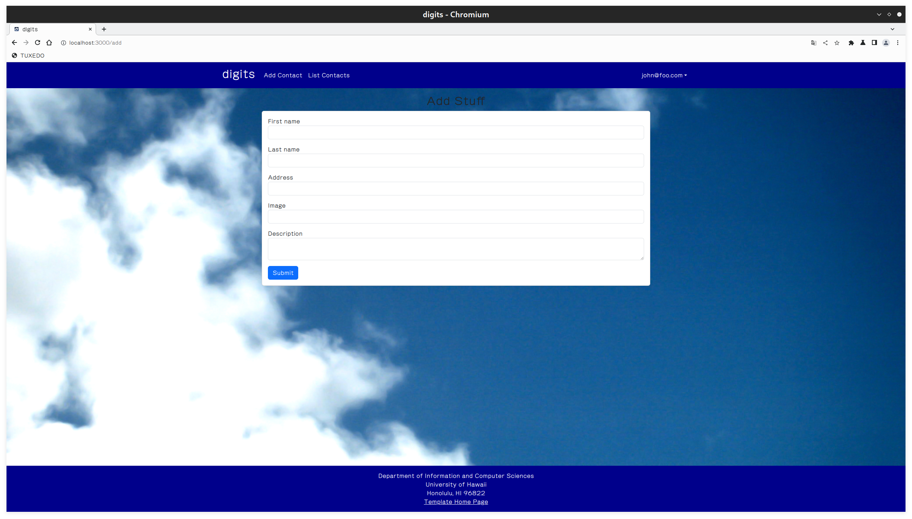
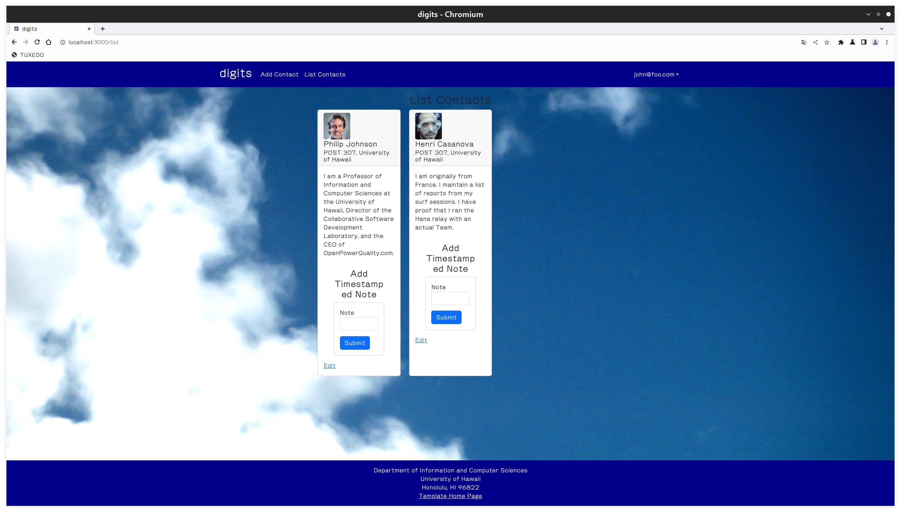
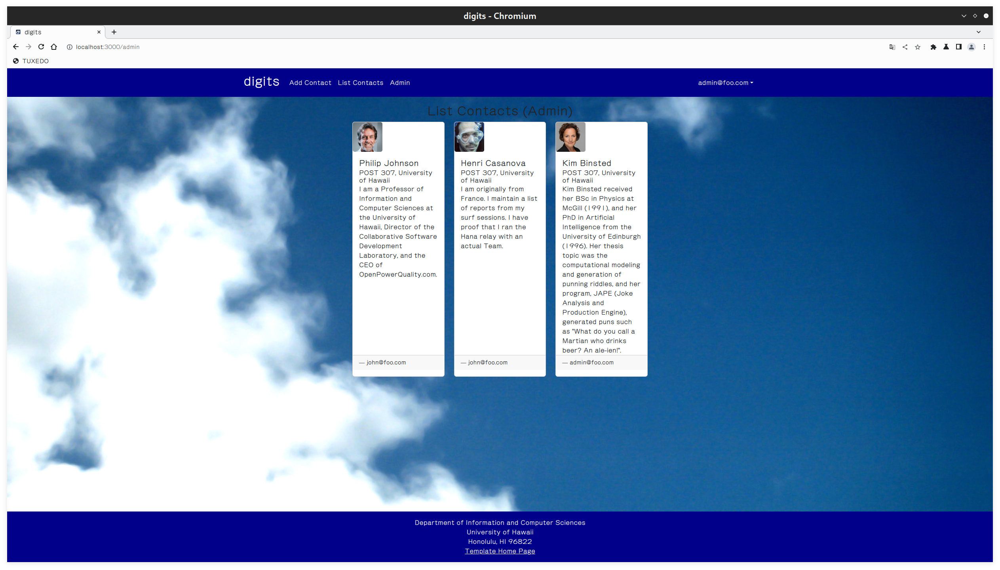

# Digits

## What is Digits?

Digits is a contact and note-taking app. Specifically, it allows you to do the following:

- Make an account
- Create and manage a set of contacts
- Timestamp notes about said contacts

(Please note that the repo is private, meaning you will need to ask permission to get a copy.)

### How to Install

1. [https://www.meteor.com/install](Install Meteor.)
2. Request your copy of Digits and wait to recieve it.
3. Use your terminal to enter the `app/` directory and run `meteor npm install` to get the required libraries.

### Running Digits

Run `meteor npm run start`, still in your `app/` directory, to start the program. You will see default data being created in your terminal as it starts, and you will find the program running at [http://localhost:3000](http://localhost:3000).

There are two accounts by default: an ordinary user named john@foo.com and an admin named admin@foo.com. Their passwords are both "changeme", which you can do in settings.development.json.

## Using Digits

### Logging in/signing up

The image you saw at the top of this document is the landing page. It explains what you can do with Digits and allows you to log in or sign up if you do not already have an account.

 

### User home page

When you sign in, your user page should look like the landing page, except the options to add and display contacts are present.

  

